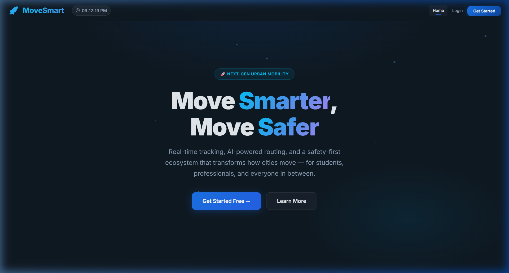
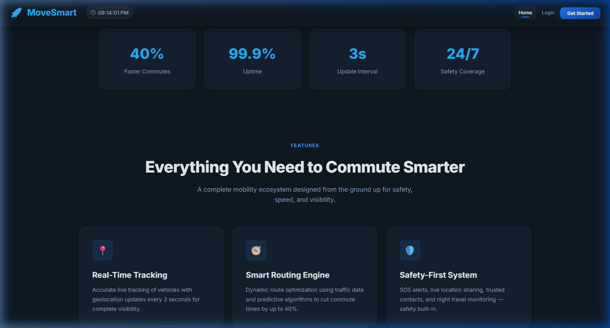
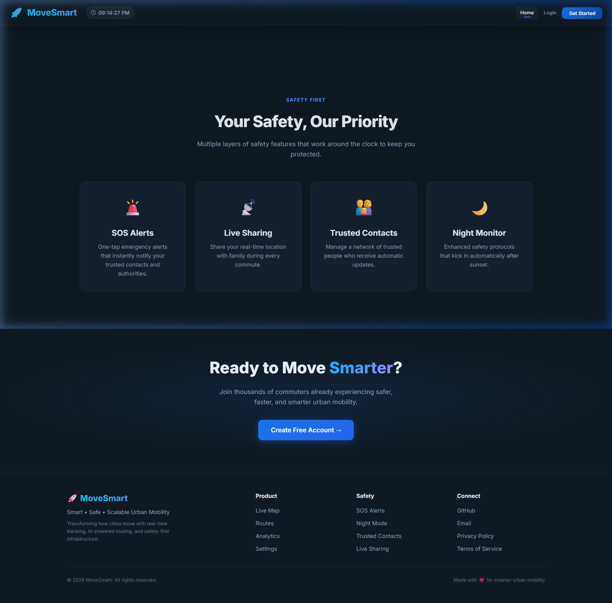
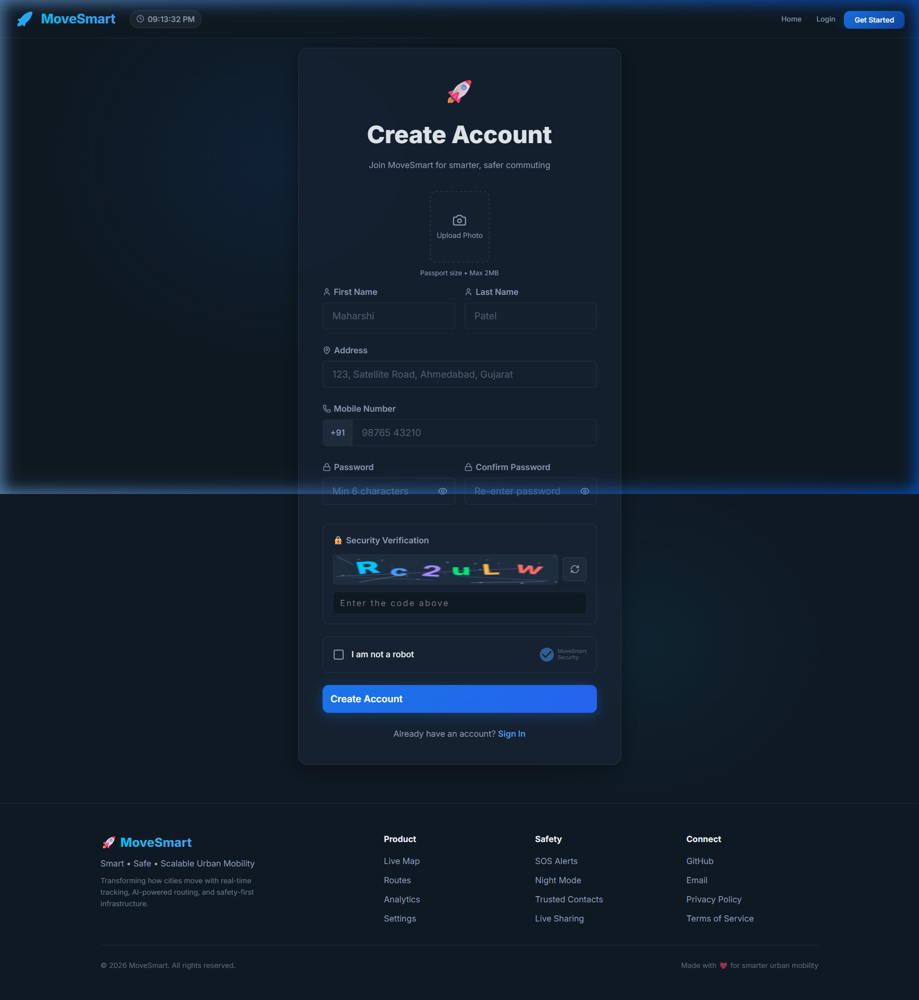

<](https://react.dev/)
[](https://vitejs.dev/)
[](https://nodejs.org/)
[](https://www.mongodb.com/)
[](https://developers.google.com/maps)
[](LICENSE)

<br/>

**A next-generation full-stack web application that transforms urban commuting through real-time vehicle tracking, AI-powered route optimization, multi-layered safety systems, school bus monitoring, and identity verification — built for the modern Indian city.**

<br/>



</div>

---

## 👋 Hello Everyone!

My name is **Patel Maharshi**, and this is **MoveSmart** — my solution to one of the most pressing challenges facing urban India today.

---

## 🔴 The Problem Statement

> **"Urban commuters in India face unsafe, unpredictable, and inefficient public transportation — leading to wasted time, daily safety risks, and zero visibility into their journey."**

Every day, millions of commuters in Indian cities face:

| Problem | Impact |
|---|---|
| 🕐 **Unpredictable transit times** | Commuters waste **40+ minutes daily** waiting with no ETA visibility |
| 🚍 **No real-time tracking** | Zero knowledge of where buses/autos are — "Is the bus even coming?" |
| 🛡️ **Safety concerns** | Women, students, and night commuters feel **unsafe** with no emergency tools |
| 🎒 **School bus anxiety** | Parents have **zero visibility** into whether their child boarded or arrived safely |
| 📊 **No commute analytics** | Users can't optimize routes because there's **no data** on their travel patterns |
| 🆔 **Identity trust issues** | No way to verify drivers, leading to **trust deficit** in shared mobility |

### 💡 The Solution — MoveSmart

MoveSmart is an **all-in-one intelligent mobility platform** that addresses every single pain point above through a unified, premium interface. It provides:

- **Real-time GPS tracking** with 3-second update intervals
- **AI-powered route optimization** cutting commute times by up to 40%
- **Multi-layered safety system** with SOS, live sharing, and night monitoring
- **Dedicated Women Safety module** inspired by bSafe
- **School Bus tracking** with student check-in/check-out visibility
- **AI Identity Verification** using face detection and liveness checks
- **Google Maps integration** for traffic data and turn-by-turn navigation
- **Analytics dashboard** for data-driven commute insights

---

## 📸 Application Preview

<div align="center">

### 🏠 Landing Page — Hero Section

*Premium dark-themed landing with animated particles and gradient typography*

### 📊 Features & Stats Overview

*40% faster commutes • 99.9% uptime • 3s update interval • 24/7 safety coverage*

### 🛡️ Safety-First Architecture

*SOS Alerts • Live Location Sharing • Trusted Contacts • Night Monitor*

### 📝 Secure Registration with CAPTCHA

*Photo upload, Indian mobile validation (+91), CAPTCHA verification, and "I am not a robot" check*

</div>

---

## ✨ Core Features

### 1. 📍 Real-Time Live Map
- **Google Maps integration** with custom dark-themed styling
- **Live vehicle tracking** — buses 🚍 and autos 🛺 with animated markers
- **3-second position updates** with smooth movement interpolation
- Vehicle info popups showing ETA, speed, occupancy, and driver details
- **Route polyline overlays** showing bus/auto paths across Ahmedabad
- **Filter & search** by vehicle type, name, or route
- **User location detection** with proximity circle

### 2. 🧭 Smart Route Management
- Create, manage, and optimize daily commute routes
- Origin → Destination path visualization with intermediate stops
- Real-time route status tracking (Active / Delayed / Inactive)
- **Time saved calculator** — see exactly how many minutes MoveSmart saves you
- Filter routes by status

### 3. 📊 Analytics Dashboard
- **Commute Performance chart** — Actual vs Optimized travel times (30-day trend)
- **Weekly trip activity** bar chart
- **Route efficiency** doughnut chart with per-route breakdown
- **Monthly summary** — trips, avg time, CO₂ saved, safety events
- **Live activity feed** with real-time updates
- Quick-action links to all modules

### 4. 🛡️ Safety Hub
- **SOS Emergency Alert** — Hold 3 seconds to trigger; notifies all trusted contacts
- **Live Location Sharing** — Share real-time GPS with trusted people during trips
- **Night Travel Mode** — Auto-activates after 8 PM with enhanced monitoring
- **Trusted Contacts** — Add/manage emergency contacts
- **Safety Score** — Dynamic score based on enabled features
- **Safety Event Timeline** — Full history of safety actions

### 5. 💜 Women Safety Module (Inspired by [bSafe](https://www.getbsafe.com))
- **Emergency SOS** with audio recording and location broadcast
- **Fake Call** — Simulate incoming call from "Mom" to exit uncomfortable situations
- **Safe Walk Timer** — Set a timer; if not stopped, guardians get auto-alerted
- **Live Video Streaming** to guardian circle
- **Guardian Circle** — Manage trusted guardians with relation tags
- **Shake to Alert** — Hands-free SOS via device shake
- **Night Mode** — Auto-enabled enhanced safety after sunset
- **Auto Location Share** & **Auto Record on SOS** toggles
- **Rotating safety tips** banner

### 6. 🎓 School Bus Tracking (Inspired by [RideZum CMX](https://www.ridezum.com))
- **Real-time school bus positions** on interactive map
- **Student check-in/check-out** status per bus
- **Driver profiles** — name, phone, rating, total trips
- **3 tabs**: Live Track 🗺️ | Schedule 📅 | Students 👨‍🎓
- **Route stop visualization** with current stop indicator
- **Delay notifications** with bus-level status badges

### 7. 🚦 Traffic & Navigation (Powered by Google Maps)
- **Real-time traffic layer** overlay
- **Turn-by-turn directions** with origin/destination search
- **ETA calculation** with traffic consideration
- **Alternative route suggestions**
- **Live vehicle overlay** on traffic map
- **Recent searches** for quick re-navigation
- Traffic layer toggle on/off

### 8. 🔐 AI Identity Verification
- **Face detection** via webcam using face-api.js
- **68-point facial landmark** detection and overlay
- **Expression analysis** — happy, sad, surprised, neutral, etc.
- **Age & gender estimation**
- **Liveness check** — confirms a real person (not a photo)
- **Multi-mode**: Driver 🚗 | Student 🎓 | Passenger 👤
- **Photo capture** and verification progress tracker
- **Detection log** with timestamped events

### 9. 🔔 Notification System
- Real-time push notifications via toast alerts
- Categories: route delays, safety events, system updates
- Notification center with unread counter in navbar

### 10. ⚙️ Settings & Profile
- Profile management
- Notification preferences
- Privacy controls
- Account settings

---

## 🏗️ Tech Stack

### Frontend
| Technology | Purpose |
|---|---|
| **React 19** | Component-based UI framework |
| **Vite 6** | Lightning-fast dev server & bundler |
| **React Router v7** | Client-side routing with protected routes |
| **Google Maps API** (`@vis.gl/react-google-maps`) | Live Map, Traffic & Navigation |
| **Leaflet + React-Leaflet** | School Bus tracking map |
| **Chart.js + react-chartjs-2** | Analytics dashboard charts |
| **face-api.js** (`@vladmandic/face-api`) | AI face detection & verification |
| **Lucide React** | Premium icon system |
| **React Hot Toast** | Toast notification system |
| **Vanilla CSS** | Custom design system with glassmorphism, dark theme |

### Backend
| Technology | Purpose |
|---|---|
| **Node.js + Express** | RESTful API server |
| **MongoDB + Mongoose** | Database & ODM |
| **JWT** (`jsonwebtoken`) | Authentication tokens |
| **bcryptjs** | Password hashing |
| **CORS** | Cross-origin resource sharing |
| **dotenv** | Environment variable management |

### API Endpoints
| Method | Endpoint | Description |
|---|---|---|
| `GET` | `/api/health` | Health check |
| `POST` | `/api/auth/register` | User registration |
| `POST` | `/api/auth/login` | User login |
| `GET` | `/api/users/profile` | Get user profile |
| `PUT` | `/api/users/profile` | Update profile |
| `GET` | `/api/routes` | Get user routes |
| `POST` | `/api/routes` | Create route |
| `GET` | `/api/notifications` | Get notifications |
| `POST` | `/api/safety/sos` | Trigger SOS alert |
| `POST` | `/api/safety/events` | Log safety event |

---

## 📁 Project Structure

```
MoveSmart/
├── frontend/                    # React + Vite Frontend
│   ├── public/                  # Static assets, manifest, robots.txt
│   ├── src/
│   │   ├── components/          # Reusable UI components
│   │   │   ├── Navbar.jsx       # Navigation with auth-aware links + clock
│   │   │   ├── Footer.jsx       # Site footer
│   │   │   ├── NotificationCenter.jsx  # Bell icon + dropdown
│   │   │   ├── ProtectedRoute.jsx      # Auth guard wrapper
│   │   │   └── SEO.jsx          # Dynamic meta tags per page
│   │   ├── pages/               # Route-level page components
│   │   │   ├── Home.jsx         # Landing page (hero, features, how-it-works)
│   │   │   ├── Login.jsx        # Authentication
│   │   │   ├── Register.jsx     # Registration with CAPTCHA + photo upload
│   │   │   ├── Dashboard.jsx    # Analytics command center
│   │   │   ├── LiveMap.jsx      # Real-time vehicle tracking (Google Maps)
│   │   │   ├── Routes.jsx       # Route CRUD management
│   │   │   ├── Safety.jsx       # Safety Hub (SOS, contacts, night mode)
│   │   │   ├── WomenSafety.jsx  # Women Safety module (bSafe-inspired)
│   │   │   ├── SchoolBus.jsx    # School bus tracking (RideZum-inspired)
│   │   │   ├── Traffic.jsx      # Traffic & Navigation (Google Directions)
│   │   │   ├── Verification.jsx # AI face detection & identity verification
│   │   │   ├── Notifications.jsx # Notification history
│   │   │   └── Settings.jsx     # User preferences
│   │   ├── data/                # Simulated data generators
│   │   │   ├── analyticsData.js # Dashboard chart data
│   │   │   └── simulatedVehicles.js  # Vehicle positions & routes
│   │   ├── hooks/
│   │   │   └── useNotifications.js    # Notification state hook
│   │   ├── App.jsx              # Root component + routing + SEO
│   │   ├── main.jsx             # App entry point
│   │   ├── index.css            # Global design system
│   │   ├── pages.css            # Page-specific styles
│   │   ├── components.css       # Component styles
│   │   ├── features.css         # Feature module styles
│   │   ├── register.css         # Registration page styles
│   │   └── verification.css     # Verification page styles
│   ├── index.html               # HTML entry with SEO meta tags
│   ├── vite.config.js           # Vite configuration
│   └── package.json
│
├── backend/                     # Node.js + Express Backend
│   ├── src/
│   │   ├── config/
│   │   │   ├── db.js            # MongoDB connection
│   │   │   └── index.js         # App configuration
│   │   ├── controllers/         # Request handlers
│   │   │   ├── authController.js
│   │   │   ├── userController.js
│   │   │   ├── routeController.js
│   │   │   ├── notificationController.js
│   │   │   └── safetyController.js
│   │   ├── models/              # Mongoose schemas
│   │   │   ├── User.js
│   │   │   ├── Route.js
│   │   │   ├── Notification.js
│   │   │   └── SafetyEvent.js
│   │   ├── routes/              # Express route definitions
│   │   │   ├── authRoutes.js
│   │   │   ├── userRoutes.js
│   │   │   ├── routeRoutes.js
│   │   │   ├── notificationRoutes.js
│   │   │   └── safetyRoutes.js
│   │   ├── middleware/
│   │   │   ├── auth.js          # JWT authentication middleware
│   │   │   └── errorHandler.js  # Global error handler
│   │   ├── utils/
│   │   │   └── validators.js    # Input validation helpers
│   │   └── server.js            # Express app entry point
│   └── package.json
│
├── docs/screenshots/            # Application screenshots
├── .gitignore
└── README.md
```

---

## 🚀 Getting Started

### Prerequisites

- **Node.js** v18+ ([Download](https://nodejs.org/))
- **MongoDB** — Local installation or [MongoDB Atlas](https://www.mongodb.com/atlas) (free tier)
- **Google Maps API Key** — [Get one here](https://console.cloud.google.com/apis/credentials) (enable Maps JavaScript API + Directions API)

### 1️⃣ Clone the Repository

```bash
git clone https://github.com/maharshijpatelcg-work/MoveSmart.git
cd MoveSmart
```

### 2️⃣ Backend Setup

```bash
cd backend
npm install
```

Create a `.env` file in the `backend/` directory:

```env
PORT=5000
MONGODB_URI=mongodb+srv://<username>:<password>@cluster.mongodb.net/movesmart
JWT_SECRET=your_super_secret_jwt_key_here
NODE_ENV=development
CLIENT_URL=http://localhost:5173
```

Start the backend server:

```bash
npm run dev
```

You should see:
```
🚀 MoveSmart API Server
   Environment : development
   Port        : 5000
   Health Check: http://localhost:5000/api/health
```

### 3️⃣ Frontend Setup

Open a **new terminal**:

```bash
cd frontend
npm install
```

Create a `.env` file in the `frontend/` directory:

```env
VITE_API_URL=http://localhost:5000/api
VITE_GOOGLE_MAPS_API_KEY=your_google_maps_api_key_here
```

Start the frontend dev server:

```bash
npm run dev
```

### 4️⃣ Open the App

Navigate to **[http://localhost:5173](http://localhost:5173)** in your browser 🎉

> 💡 **Note:** The frontend works even without the backend — it gracefully falls back to demo mode with simulated data and local storage.

---

## 📖 How to Use the Application

### Step 1: Register Your Account
1. Click **"Get Started"** on the home page
2. Upload a **passport-sized photo** (max 2MB)
3. Fill in your **name**, **address**, and **mobile number** (+91 format)
4. Create a **password** (min 6 characters)
5. Complete the **CAPTCHA** security challenge
6. Check **"I am not a robot"**
7. Click **"Create Account"** → You'll be redirected to your Dashboard

### Step 2: Explore the Dashboard
- View your **commute performance** (Actual vs Optimized times)
- Check **weekly trip stats** and **route efficiency**
- See **CO₂ saved** and **monthly summaries**
- Use **Quick Actions** to jump to any module

### Step 3: Track Vehicles on Live Map
- Navigate to **Map** from the navbar
- See **all active vehicles** (buses 🚍 and autos 🛺) moving in real-time
- Click any vehicle to see **ETA, speed, occupancy, and driver info**
- Use **filters** to show only buses or autos
- Toggle **route lines** on/off
- Click **"My Location"** to center on your position

### Step 4: Manage Your Routes
- Go to **Routes** → Click **"New Route"**
- Enter origin, destination, and number of stops
- See **time saved** by each optimized route
- Filter by status: Active, Delayed, Inactive

### Step 5: Use Safety Features
- Navigate to **Safety Hub**
- **Hold the SOS button for 3 seconds** to trigger emergency alert
- Enable **Live Location Sharing** with trusted contacts
- **Night Mode** auto-activates after 8 PM
- Add **trusted contacts** for emergency notifications

### Step 6: Women Safety Module
- Go to **Women Safety** from the navbar
- **SOS Emergency** — Hold to activate (alerts guardians + starts audio recording)
- **Fake Call** — Simulate a call from "Mom" to exit uncomfortable situations
- **Safe Walk Timer** — Set a timer; if you don't stop it, your guardians are alerted
- **Live Stream** — Stream video to your guardian circle
- Enable **Shake to Alert** for hands-free emergency activation
- Add **guardians** with name, phone, and relationship

### Step 7: Track School Buses
- Navigate to **School Bus**
- View all **active buses** on the map with real-time positions
- Switch tabs: **Live Track** | **Schedule** | **Students**
- See **student check-in/check-out** status
- View **driver profiles** with ratings and call buttons
- Check **route schedules** with departure/arrival times

### Step 8: Traffic & Navigation
- Go to **Traffic** from the navbar
- Enter **origin** and **destination** to get directions
- Toggle the **traffic layer** to see real-time congestion
- View **distance, ETA, and alternative routes**
- Use **recent searches** for quick re-navigation

### Step 9: Verify Identity
- Navigate to **Verify** in the navbar
- Select mode: **Driver** 🚗 | **Student** 🎓 | **Passenger** 👤
- Click **"Start Camera"** → Position your face in the frame
- Click **"Verify Identity"** → Watch the 4-step verification:
  1. Face Detection → 2. Liveness Check → 3. Expression Analysis → 4. Complete ✅
- View **real-time detection data**: confidence %, age, gender, expression, landmarks

---

## 🎯 Key Inspirations

| Feature | Inspired By | Our Enhancement |
|---|---|---|
| Women Safety | [bSafe](https://www.getbsafe.com) | Added fake call, safe walk timer, live streaming |
| School Bus Tracking | [RideZum CMX](https://www.ridezum.com) | Added student check-in/out, driver profiles |
| Traffic Navigation | Google Maps | Added vehicle overlay + real-time fleet integration |
| Identity Verification | Airport biometrics | Made it accessible via browser with AI face-api.js |

---

## 🔐 Security Features

- ✅ **JWT authentication** with token-based sessions
- ✅ **bcrypt password hashing** (never stores plain text)
- ✅ **CAPTCHA verification** on registration (canvas-rendered, not third-party)
- ✅ **"I am not a robot"** confirmation step
- ✅ **Indian mobile number validation** (10 digits, starts with 6-9)
- ✅ **Protected routes** — Dashboard, Map, Safety, etc. require login
- ✅ **Environment variables** for all sensitive keys (`.env` not committed)
- ✅ **CORS** configured for frontend-only access

---

## 🎨 Design Philosophy

- **Dark Theme** — Premium glassmorphism-based UI with deep navy backgrounds
- **Micro-animations** — Smooth fade-ins, particle effects, and hover transitions
- **Mobile Responsive** — Hamburger nav, fluid grids, and adaptive layouts
- **Accessibility** — Semantic HTML, ARIA labels, keyboard navigation
- **SEO Optimized** — Dynamic meta tags, Open Graph, proper heading hierarchy

---

## 📜 Environment Variables Reference

### Backend (`backend/.env`)
| Variable | Description | Example |
|---|---|---|
| `PORT` | Server port | `5000` |
| `MONGODB_URI` | MongoDB connection string | `mongodb+srv://...` |
| `JWT_SECRET` | Secret key for JWT tokens | `your_secret_key` |
| `NODE_ENV` | Environment mode | `development` |
| `CLIENT_URL` | Frontend URL for CORS | `http://localhost:5173` |

### Frontend (`frontend/.env`)
| Variable | Description | Example |
|---|---|---|
| `VITE_API_URL` | Backend API base URL | `http://localhost:5000/api` |
| `VITE_GOOGLE_MAPS_API_KEY` | Google Maps API key | `AIza...` |

---

## 🤝 Contributing

1. Fork the repository
2. Create your feature branch (`git checkout -b feature/amazing-feature`)
3. Commit your changes (`git commit -m 'Add amazing feature'`)
4. Push to the branch (`git push origin feature/amazing-feature`)
5. Open a Pull Request

---

## 📄 License

This project is licensed under the MIT License — see the [LICENSE](LICENSE) file for details.

---

<div align="center">

### Built with ❤️ by [Patel Maharshi](https://github.com/maharshijpatelcg-work)

**MoveSmart** — _Smart • Safe • Scalable Urban Mobility_

⭐ Star this repo if you found it useful!

</div>
]]>
